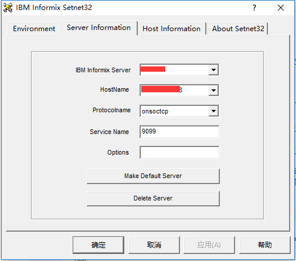
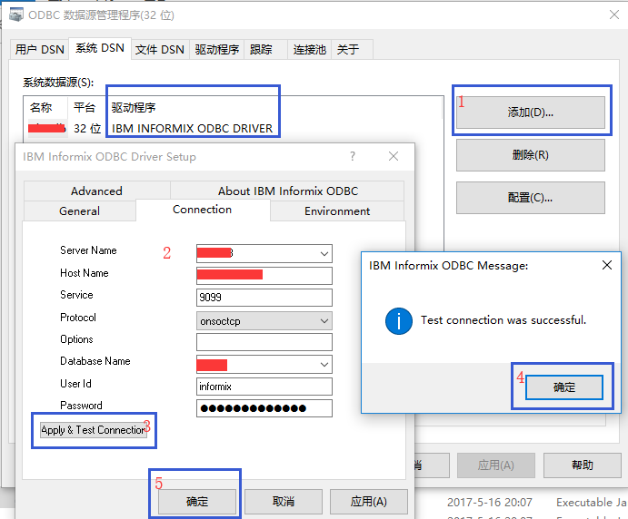

<h1 id="myTitle" style="text-align:center;">ETL之Kettle使用手册2019（更新中）</h1>

* [1. 写在前面的话](#1-写在前面的话)
* [2. Kettle连接数据库](#2-kettle连接数据库)
	* [2.1. ODBC方式](#21-odbc方式)
		* [2.1.1. ODBC连Oracle](#211-odbc连oracle)
		* [2.1.2. ODBC连Informix](#212-odbc连informix)
	* [2.2. JDBC方式](#22-jdbc方式)
		* [2.2.1. JDBC连Informix](#221-jdbc连informix)
		* [2.2.2. JDBC连Oracle](#222-jdbc连oracle)
		* [2.2.3. JDBC连Impala](#223-jdbc连impala)
	* [2.3. 通用数据库方式](#23-通用数据库方式)
		* [2.3.1. hsqlDB](#231-hsqldb)
	* [2.4. JNDI方式](#24-jndi方式)
		* [2.4.1. JNDI连Oracle](#241-jndi连oracle)
		* [2.4.2. JNDI连h2](#242-jndi连h2)
* [3. Kettle脚本运行](#3-kettle脚本运行)
	* [3.1. 如何运行](#31-如何运行)
		* [3.1.1. linux例子](#311-linux例子)
		* [3.1.2. windows例子](#312-windows例子)
	* [3.2. 例子说明](#32-例子说明)
	* [3.3. 关于日志等级说明](#33-关于日志等级说明)
	* [3.4. 转换日志输出说明](#34-转换日志输出说明)
* [4. JavaScript组件](#4-javascript组件)
	* [4.1. 获取变量](#41-获取变量)
	* [4.2. EncryptPassword](#42-encryptpassword)
	* [4.3. 获取数据库信息](#43-获取数据库信息)
	* [4.4. JS循环处理判断](#44-js循环处理判断)
	* [4.5. 字段处理](#45-字段处理)
	* [4.6. 行数据新增/复制](#46-行数据新增复制)
	* [4.7. 时间转换](#47-时间转换)
	* [4.8. bytes?](#48-bytes)
	* [4.9. JS弹出框输入](#49-js弹出框输入)
	* [4.10. JS日志输出](#410-js日志输出)
	* [4.11. 导出导入资源库](#411-导出导入资源库)
* [5. Java相关组件](#5-java相关组件)
* [6. 我的案例积累](#6-我的案例积累)
	* [6.1. 数据库迁移](#61-数据库迁移)
	* [6.2. 调用webService接口处理数据入库](#62-调用webservice接口处理数据入库)
	* [6.3. 增量同步](#63-增量同步)
	* [6.4. 读取数据库数据生成xml文件](#64-读取数据库数据生成xml文件)
	* [6.5. 读取xml文件](#65-读取xml文件)
	* [6.6. 生成指定分隔符文件上传FTP服务器](#66-生成指定分隔符文件上传ftp服务器)
	* [6.7. 采集文件解析入库](#67-采集文件解析入库)
		* [6.7.1. CRT采集](#671-crt采集)
		* [6.7.2. FTP/SFTP](#672-ftpsftp)
		* [6.7.3. 文本文件](#673-文本文件)
		* [6.7.4. ZIP/gz](#674-zipgz)
		* [6.7.5. JSON文件](#675-json文件)
	* [6.8. 生成报表](#68-生成报表)
	* [6.9. 统计数据](#69-统计数据)
		* [6.9.1. 行列转换](#691-行列转换)
		* [6.9.2. 分组聚合](#692-分组聚合)
		* [6.9.3. 过滤去重](#693-过滤去重)
* [7. 常用调度方案](#7-常用调度方案)
	* [7.1. 任务计划定时](#71-任务计划定时)
	* [7.2. Crontab任务](#72-crontab任务)
	* [7.3. Jenkins](#73-jenkins)
	* [7.4. 其他](#74-其他)
* [8. 完整的开发实例](#8-完整的开发实例)
	* [8.1. 一次基于资源库和Jenkins调度的Linux开发案例](#81-一次基于资源库和jenkins调度的linux开发案例)
		* [8.1.1. 环境](#811-环境)
			* [8.1.1.1. 开发环境](#8111-开发环境)
			* [8.1.1.2. 生产环境](#8112-生产环境)
		* [8.1.2. 设计](#812-设计)
			* [8.1.2.1. 业务说明](#8121-业务说明)
			* [8.1.2.2. 流程组件设计](#8122-流程组件设计)
		* [8.1.3. 开发](#813-开发)
			* [8.1.3.1. 资源库](#8131-资源库)
			* [8.1.3.2. 流程开发](#8132-流程开发)
		* [8.1.4. 部署](#814-部署)
			* [8.1.4.1. 拷贝资源库](#8141-拷贝资源库)
			* [8.1.4.2. 修改资源库信息](#8142-修改资源库信息)
		* [8.1.5. 验证](#815-验证)
			* [8.1.5.1. 测试程序](#8151-测试程序)
			* [8.1.5.2. 新建调度](#8152-新建调度)
			* [8.1.5.3. 构建任务](#8153-构建任务)
			* [8.1.5.4. 观察日志](#8154-观察日志)
	* [8.2. 一次基于命名参数Windows开发案例](#82-一次基于命名参数windows开发案例)
		* [8.2.1. 环境](#821-环境)
		* [8.2.2. 开发设计](#822-开发设计)
		* [8.2.3. 验证](#823-验证)
			* [8.2.3.1. 测试程序](#8231-测试程序)
			* [8.2.3.2. 新建调度](#8232-新建调度)
			* [8.2.3.3. 构建任务](#8233-构建任务)
			* [8.2.3.4. 观察日志](#8234-观察日志)
* [9. 常遇到的问题集锦](#9-常遇到的问题集锦)
	* [9.1. 安装相关](#91-安装相关)
		* [9.1.1. JVM提示不能正常启动](#911-jvm提示不能正常启动)
	* [9.2. 资源库相关](#92-资源库相关)
		* [9.2.1. 资源库的位置](#921-资源库的位置)
		* [9.2.2. 新安装的KETTLE资源库点击 connect 后一片空白](#922-新安装的kettle资源库点击-connect-后一片空白)
	* [9.3. 数据库相关](#93-数据库相关)
		* [9.3.1. 驱动找不到](#931-驱动找不到)
		* [9.3.2. ODBC不支持](#932-odbc不支持)
		* [9.3.3. Informix中文乱码](#933-informix中文乱码)
	* [9.4. 跨平台相关](#94-跨平台相关)
		* [9.4.1. 迁移到Linix日志乱码](#941-迁移到linix日志乱码)
* [10. About](#10-about)


## 1. 写在前面的话
 Kettle是免费开源的基于java的企业级ETL（Extract-Transform-Load的缩写，即数据抽取、转换、装载的过程）工具，功能强大简单易用。Kettle支持图形化的GUI设计界面，可以以工作流的形式流转，做一些简单或复杂的数据抽取、质量检测、数据清洗、数据转换、数据过滤、统计分析、报表输出等类型的工作，可以减少的研发工作量，降低技术门槛，提高工作效率。几个显著的特点是：
* 工作稳定
* 跨平台，免费开源
* 绿色免安装，易配置
* 图形界面设计，易入门
* 定时功能
* 支持关系型数据库，多种文本文件，Hadoop等

Kettle家族几个常用的产品：
- SPOON：允许你通过图形界面来设计ETL转换（Transformation）和作业（Job）
- PAN：允许你运行由Spoon设计的Transformation。Pan是一个后台执行的程序，没有图形界面
- KITCHEN：允许你运行由Spoon设计的Job。Kitchen是一个后台执行的程序，没有图形界面

## 2. Kettle连接数据库

详见[PDI 学习3：数据库连接](https://www.cnblogs.com/missfox18/p/215340.html)。
### 2.1. ODBC方式
**不推荐**，jdk8以上不支持odbc。
#### 2.1.1. ODBC连Oracle
* Windows机器安装oracle客户端(也可在官网下载Oracle的Odbc包)，创建ODBC数据源

详细见官网 [创建一般 ODBC 连接](https://docs.oracle.com/middleware/bidvhelp/desktop/zh_CN/BIDVD/GUID-13FE85B3-AEEC-4A2E-AD23-EDD4810EF4CE.htm#BIDVD-GUID-13FE85B3-AEEC-4A2E-AD23-EDD4810EF4CE)。
* 填写数据库信息，点击测试连接，输入账号密码测试通过
* 在Spoon界面新建连接，选择Oracle+ODBC方式连接,注意DSN和创建的数据源名称一致
#### 2.1.2. ODBC连Informix
区别在于驱动，需要下载IBM Informix Client-SDK，根据系统版本下载安装后设置如图所示：






配置KETTLE数据源的时候，记住使用DSN名称。
### 2.2. JDBC方式
**推荐**，常用的数据库连接方式。需要准备相关的驱动包，有时候如果数据库连接失败，需要注意是否驱动包版本太低。

基本的新建方式为：
获取jdbc驱动，放在data-integration\lib 目录下
 Spoon界面新建数据库连接

#### 2.2.1. JDBC连Informix
* 需要准备驱动包如图所示：
* 针对Informix中文乱码需要设置
* 预览数据乱码
  
#### 2.2.2. JDBC连Oracle

#### 2.2.3. JDBC连Impala


### 2.3. 通用数据库方式
本质上是jdbc方式
#### 2.3.1. hsqlDB
* 下载相应的JDBC驱动,比如 hsqldb-jar ，放在  ..\lib 目录下
* 配置Spoon界面数据库连接
  - 连接方式选择JDBC
  - 连接类型选择通用数据库：Generic database
  - 连接名称如：test_hsqlDB
  - URL如：jdbc:hsqldb:hsql://IP:PORT;
  - 选择驱动名称：org.hsqldb.jdbcDriver( 刚刚的驱动包呐 )
  - 一般用户名 sa ,无密码；
### 2.4. JNDI方式

#### 2.4.1. JNDI连Oracle

#### 2.4.2. JNDI连h2

## 3. Kettle脚本运行
### 3.1. 如何运行
#### 3.1.1. linux例子
```sh
#!/bin/sh -l

# 执行日期
exec_date=`date +%Y%m%d`
# 定义日志文件
log_file=/opt/pdi/log/dataSync/"$exec_date"tco_pro.log
# 执行的脚本
exec_job=dataSync/finally-Sync-tco_pro

# job
sh $KETTLE_HOME/kitchen.sh -rep=myRepo -user=admin -pass=admin -job=$exec_job -level=basic>>$log_file

# trans
# sh $KETTLE_HOME/pan.sh -rep=myRepo -user=admin -pass=admin -trans=$exec_trans -level=basic>>$log_file
```
#### 3.1.2. windows例子
```bat
@echo off
setlocal enabledelayedexpansion 
for /f "tokens=2 delims==" %%a in ('wmic path win32_operatingsystem get LocalDateTime /value') do (
  set t=%%a
)
rem 执行日期
set exec_date=%t:~0,4%-%t:~4,2%-%t:~6,2%-%t:~8,2%
rem 定义日志文件
set log_file=E:\PDI\Logs\dataSync\%exec_date%tco_pro.log
rem 执行的脚本
set exec_job=dataSync//finally-Sync-tco_pro

rem job DT是命名参数
%KETTLE_HOME%\Kitchen.bat -rep myRepo -user admin -pass admin -job %exec_job% -param:"DT=%YYYYMMDD%"  -level=basic>> %log_file%
rem trans
rem %KETTLE_HOME%\pan.bat -rep=myRepo -user=admin -pass=admin -trans=%exec_trans% -level=basic>> %log_file%
```
### 3.2. 例子说明
* 作业和转换
     job由kitchen脚本执行
     trans由pan脚本执行
* 跨平台
     linux系统对应的是`kitchen.sh`和`pan.sh`
     windows系统对应的是`kitchen.bat`和`pan.bat`
* 使用资源库
     不使用资源库需要使用作业和转换的绝对路径以及后缀
     使用资源库可以更好的管理数据链接，作业和转换；推荐使用资源库。
* 以下是一个不使用资源库的例子
```sh
$KETTLE_HOME/kitchen.sh -file /opt/pdi/program/dataSync/finaly-test.kjb -level Basic -logfile /opt/pdi/log/dataSync/2019041_test.log
```
* 关于执行参数说明
参数脚本
### 3.3. 关于日志等级说明

日志输出共分七个等级：没有日志`Nothing`、错误日志`Error`、最小日志`Minimal`、基本日志`Basic`、详细日志`Detailed`、调试日志`Debug`、行级日志`Rowlevel`。默认为基本日志。

如例子中的`-level Basic`可缺省，表示基本日志。

* Nothing: 不显示任何输出
* Error: 仅仅显示错误信息
* Minimal: 使用最小的日志
* Basic: 缺省的日志级别
* Detailed: 给出日志输出的细节
* Debug: 调试目的，调试输出
* Rowlevel: 打印出每一行记录的信息

### 3.4. 转换日志输出说明
下面是一个基本日志输出的例子：
* I: 当前步骤生成的记录数（从表输入、文件读入）
* O: 当前步骤输出的记录数（输出到文件、表）
* R: 当前步骤从前一步聚读取的记录数
* W: 当前步骤向后面步骤抛出的记录数
* U: 当前步骤更新过的记录数
* E: 当前步骤处理出错的记录数


## 4. JavaScript组件
Kettle支持使用JS组件，下面列出一些常使用的功能。
### 4.1. 获取变量
命名参数和变量的在js里获取。
```js
//默认密码123456
var palin_code=getVariable("PLAIN_CODE","123456");
```
### 4.2. EncryptPassword
例如：Kettle数据库文件 .kjb 里 password 为加密结果。
```js
//对应的palin_code：WYJCfw!208uIY
//Encrypted 2be98af9f33edb182bc58fc2086886e3
var encrypted_password = "Encrypted " + Packages.org.pentaho.di.core.encryption.Encr.encryptPassword(palin_code);
```
### 4.3. 获取数据库信息
```js
var db = _step_.getTransMeta().findDatabase("208niosdb");

//jdbc:informix-sqli://10.230.6208:9099/niosdb:INFORMIXSERVER=nios208;;NEWCODESET=GBK,8859_1,819;;DELIMIDENT=Y
var url = db.getURL();
//10.230.6208
var hostname = db.getHostname();
```
### 4.4. JS循环处理判断
JS脚本会对每一个数据流操作，我们可以在某条数据处理完毕后停止。
```js
trans_Status = CONTINUE_TRANSFORMATION;
//获取当前js处理第几条流数据
var processCount=getProcessCount("r");

if(getProcessCount("r")>5) { 

    //可以在第五条后停止循环处理
    trans_Status = SKIP_TRANSFORMATION;
}
```
### 4.5. 字段处理
```js
//字段和字段类型的对象集合
var a = getInputRowMeta();
//第一个字段的类型
var field1_type = getInputRowMeta().getValueMeta(0).getTypeDesc();

for (var i=0;i<getInputRowMeta().size();i++) { //loop through the actual row

  // Grab the metadata for this value
  var valueMeta = getInputRowMeta().getValueMeta(i);

  //using the IDs instead of "String" would make it faster, see API for the IDs
  if (valueMeta.getTypeDesc().equals("String")) { //only for String types
    //所有字符类型字段数据里的 'E'替换成 'M'
    row[i]=replace(row[i],'E','M');
  }
}

```
### 4.6. 行数据新增/复制
该功能用来伪造数据（我确实干过）真的六到飞起。
* 处理前数据
  
|member|groupsField|
|-|-|
|Member 1|	Group1, Group2, Group3, Group4|
|Member 2|	Group1, Group2|

```js

if (groupsField!=null) 
{
  var groups = groupsField.split(",");
 
  for (i=0;i<groups.length;i++)
  {
    newRow = createRowCopy(getOutputRowMeta().size());
    var rowIndex = getInputRowMeta().size();

    newRow[rowIndex++] = trim( groups[i] );
    newRow[rowIndex++] = "N";

    putRow(newRow);
  }
}

var subgroup = "";
var ignore = "Y";
```
* 处理后数据
  
|member|groupsField|subgroup|ignore|
|-|-|-|-|
|Member 1|	Group1, Group2, Group3, Group4|	Group1|	N|
|Member 1|	Group1, Group2, Group3, Group4|	Group2|	N|
|Member 1|	Group1, Group2, Group3, Group4|	Group3|	N|
|Member 1|	Group1, Group2, Group3, Group4|	Group4|	N|
|Member 1|	Group1, Group2, Group3, Group4|	|	Y|
|Member 2|	Group1, Group2|		Group1|N|
|Member 2|	Group1, Group2|		Group2|N|
|Member 2|	Group1, Group2|		|Y|
### 4.7. 时间转换
一般周期运行的程序都会用到。
```js
// 2019/04/1 16:20:2295
var now=new java.util.Date();
// 昨天
var lastDay=new java.util.Date();
// 2019/04/16 16:20:2295
lastDay.setDate(lastDay.getDate()-1);
//2019-04-1 16:20:24
var nowStr=date2str(now,'yyyy-MM-dd HH:mm:ss');
// 20
var interval = dateDiff(lastDay,now,'HH');

// C:\temp\LIM_kettle\ST1PROTOKL.TENOPROD_2006_0_21_00_09
var dat = DIR.Clone().rightstr(16).str2dat("yyyy_MM_dd_HH_mm");
// 2006/0/21 00:09:00.000
```
### 4.8. bytes?
```js
var F1 = 'VGV4dCBmaWxlIGlucHV0';
// binary:
var bytes = Packages.org.apache.commons.codec.binary.Base6decodeBase64( FgetString().getBytes() );
// 
var decString = new Packages.java.lang.String( bytes );
// VGV4dCBmaWxlIGlucHV0
var encString = new Packages.java.lang.String( Packages.org.apache.commons.codec.binary.Base6encodeBase64( decString.getBytes() ) );
```	
### 4.9. JS弹出框输入
sample里给的一个例子，弹出框输入开始日期和结束日期：
```js
// This JavaScript asks for a start and ending date with text dialog boxes.
// It is  a proof of concept if dialogs could be used out of JavaScript within transformations.
// This could be a base for discussion if a general input step dialog should be created.
// It runs within Spoon, Pan and launched by the "Test script" button within the JavaScript editor.
// @author Jens Bleuel
// @since 2006-0-11


// to get the "Test script" button at the editor working correctly we need the existing Display / Shell
var display;
var displayHasToBeDisposed=false;
var shell=null;

try {
    display=Packages.org.eclipse.swt.widgets.Display.getCurrent();
    shell=display.getActiveShell();
} catch(e) {
    // if it runs in batch mode (Pan or preview mode) no Display is available, so we have to create one
    display=new Packages.org.eclipse.swt.widgets.Display();
    displayHasToBeDisposed=true;
    shell=new Packages.org.eclipse.swt.widgets.Shell(display);
}

// if we run in Pan we need to load the properties:
if(!Packages.org.pentaho.di.ui.core.PropsUI.isInitialized()) {
    Packages.org.pentaho.di.ui.core.PropsUI.init(display,2); //2=TYPE_PROPERTIES_PAN
}

var dateDefaultFrom=DateFromProposal.getString().substr(0,10); //only the date and not the time
var dialogDateFrom=new Packages.org.pentaho.di.ui.core.dialog.EnterTextDialog(shell, "Date from", "Please enter the beginning date", dateDefaultFrom);
var dateFromAsString=dialogDateFrom.open();

if(dateFromAsString!=null && dateFromAsString.length()>0) {
    var dateDefaultTo=DateToProposal.getString().substr(0,10); //only the date and not the time;
    var dialogDateTo=new Packages.org.pentaho.di.ui.core.dialog.EnterTextDialog(shell, "Date to", "Please enter the ending date", dateDefaultTo);
    var dateToAsString=dialogDateTo.open();
    if(dateToAsString!=null && dateToAsString.length()>0) {
        // here you could check or change formats a.s.o
    } else {
        // stop transformation when user cancels
        throw new Packages.java.lang.RuntimeException("Input canceled by the user.");
    }
} else {
    // stop transformation when user cancels
    throw new Packages.java.lang.RuntimeException("Input canceled by the user.");
}

if(displayHasToBeDisposed) {
  display.dispose();
}
```
### 4.10. JS日志输出
在第五行输出字符串：
```js
if(getProcessCount("r")=5) { 
  writeToLog('m',str);
}
```
### 4.11. 导出导入资源库
```js
/*
 * 导出
 */
// Get the repository we're connected to
var rep = _step_.getTrans().getRepository();
// Ask the repository for its exporter
var exporter = rep.getExporter();
// Find the directory to export in the repository
var repdir = rep.loadRepositoryDirectoryTree().findDirectory(directory);
// Export all the objects from the directory into the filename we specified
exporter.exportAllObjects(null, filename, repdir, "all");

/*
 * 导入
 */
// Get the repository we're connected to
var rep = _step_.getTrans().getRepository();
// Load the repository directory structure
var root = rep.loadRepositoryDirectoryTree();

// Find the directory we want to import into in the repository and create it if it doesn't exist.
//
var repdir = root.findDirectory(directory);
if (repdir==null) {
 repdir = rep.createRepositoryDirectory(root, directory);
}
// Ask the repository for its importer
var importer = rep.getImporter();

// Set the directory overrides if they're being used
if (transDirOverride != null && !"".equals(transDirOverride)) {
  importer.setTransDirOverride(transDirOverride);
}
if (jobDirOverride != null && !"".equals(jobDirOverride)) {
  importer.setJobDirOverride(jobDirOverride);
}

// Get the file that was specified as FILENAME
var file = new Packages.java.io.File(filename);

// Must pass file names to import as an array
var filenames = null;
// Check if the filename is a directory
if (file.isDirectory()) {
  // If the file is a directory find all the files inside of it
  // and use those for the import
  var files = file.listFiles();
  filenames = java.lang.reflect.Array.newInstance(
    java.lang.String, // Element type, do not change
    files.length  // Number of file names to pass in
  );
  for (i=0;i<files.length;i++) {
    filenames[i] = files[i].getAbsolutePath();
  }
} else {
  // If the file is not a directory it is the only file to be used
  // for importing
  filenames = java.lang.reflect.Array.newInstance(
    java.lang.String, // Element type, do not change
    1  // Number of file names to pass in
  );
  filenames[0] = filename;
}

// Set the overwrite flag
var overwrite = Packages.java.lang.Boolean.parseBoolean(overwrite);

// Perform the import
//
importer.importAll(
   importer,        // The feedback object
   null,            // Relative file directory of filenames (next parameter)
   filenames,       // The export files to import
   repdir,          // The directory to import into
   overwrite,            // Overwrite existing objects
   true,            // Continue on error
   "Batch import"); // Version comment

```
## 5. Java相关组件

## 6. 我的案例积累

### 6.1. 数据库迁移

### 6.2. 调用webService接口处理数据入库

### 6.3. 增量同步

### 6.4. 读取数据库数据生成xml文件

### 6.5. 读取xml文件

### 6.6. 生成指定分隔符文件上传FTP服务器

### 6.7. 采集文件解析入库

#### 6.7.1. CRT采集

#### 6.7.2. FTP/SFTP

#### 6.7.3. 文本文件

#### 6.7.4. ZIP/gz

#### 6.7.5. JSON文件

### 6.8. 生成报表

### 6.9. 统计数据

#### 6.9.1. 行列转换

#### 6.9.2. 分组聚合

#### 6.9.3. 过滤去重

## 7. 常用调度方案

### 7.1. 任务计划定时

### 7.2. Crontab任务

### 7.3. Jenkins

### 7.4. 其他

## 8. 完整的开发实例
从部署到维护，分别给出Linux和Windows平台的两个例子，仅供参考。
### 8.1. 一次基于资源库和Jenkins调度的Linux开发案例
#### 8.1.1. 环境
##### 8.1.1.1. 开发环境
##### 8.1.1.2. 生产环境

#### 8.1.2. 设计
##### 8.1.2.1. 业务说明
##### 8.1.2.2. 流程组件设计

#### 8.1.3. 开发
##### 8.1.3.1. 资源库
##### 8.1.3.2. 流程开发

#### 8.1.4. 部署
##### 8.1.4.1. 拷贝资源库
##### 8.1.4.2. 修改资源库信息

#### 8.1.5. 验证
##### 8.1.5.1. 测试程序
##### 8.1.5.2. 新建调度
##### 8.1.5.3. 构建任务
##### 8.1.5.4. 观察日志

### 8.2. 一次基于命名参数Windows开发案例
#### 8.2.1. 环境
#### 8.2.2. 开发设计
#### 8.2.3. 验证
##### 8.2.3.1. 测试程序
##### 8.2.3.2. 新建调度
##### 8.2.3.3. 构建任务
##### 8.2.3.4. 观察日志

## 9. 常遇到的问题集锦
### 9.1. 安装相关
#### 9.1.1. JVM提示不能正常启动
可视化界面spoon.bat打不开，JVM提示不能正常启动

1. 检查一下环境变量的配置

2. 检查一下JDK版本，新版本最好用1.6以上
```do
java -version
```

3. 新安装了高版本jdk，环境变量也没问题，但是java -version 版本还是老的，那就检查一下原版本的的快捷方式java.exe还在不在，在的话就删掉。

可能查找的地方有：　　　　　　
  * C:\ProgramData\Java\javapath
  * C:\windows\System32 

4. 文本方式打开spoon.bat ，修改内存配置
### 9.2. 资源库相关
#### 9.2.1. 资源库的位置
新版本的资源库连接在右上角O(∩_∩)O哈！
#### 9.2.2. 新安装的KETTLE资源库点击 connect 后一片空白
看一下本地IE的版本，升级到9及9以上吧~
### 9.3. 数据库相关
#### 9.3.1. 驱动找不到
#### 9.3.2. ODBC不支持
JDK1.8不支持了。
#### 9.3.3. Informix中文乱码

### 9.4. 跨平台相关
#### 9.4.1. 迁移到Linix日志乱码

## 10. About

| Key | Value |
|---|---|
|  *Author* |missfox|
|  *Date*   |2019-04-18 11:16:00|
|  *Email*  |missfoxw@16com|
|  *说明*   |新增文档（案例vscode写markdown）|

[返回顶部↑](#myTitle)

<style>
    /*列宽度自适应不换行*/
    table td { white-space:nowrap; }
    /*表头颜色*/  
    /* table thead{background-color:rgb(58, 140, 201);} */
    /*斑马线 */
    table tr:nth-of-type(2n){background-color:rgb(235, 235, 235);}
    table td:nth-of-type(2n){color:rgb(19, 13, 202);}
</style>
