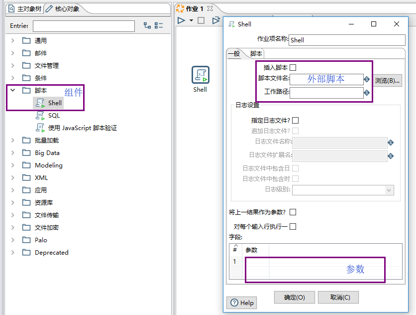

遇到的一个案例是需要直连多个服务器通过命令获取回复内容进行解析，当时的生产环境是windows，于是便使用了SecureCRT工具。

需要准备如下工具:

1. SecureCRT工具，安装后获取可执行文件目录`F:\tools\SecureCRT\SecureCRT.exe`
2. 准备配置文件，描述多个服务器的信息
3. 新建一个文件夹作为工作目录录，如`E:\PDI\getFileByCRT\` 在这个文件夹下面建立三个文件
   - [X] run.bat :运行整个脚本，这个单元可以作为一个流水工人嵌入到Kettle作业流水线中去
   - [X] IP.txt ：描述多个服务器的IP，因为本例中这些服务器的账号密码一直，获取内容的命令也一致
   - [X] Connect.vbs ：连CRT获取内容

分别列出各个文件的脚本（需要了解一些dos和vbs)

* **IP.txt**

多个服务器的IP，一个IP一行。

```dos
10.XXX.XXX.1
10.XXX.XXX.2
10.XXX.XXX.3
10.XXX.XXX.4
10.XXX.XXX.5
10.XXX.XXX.6
10.XXX.XXX.7
```

* **run.bat**

文件最终存储的目录是`E:\PDI\getFileByCRT\[IP]\[yyyyMMdd].txt`

```dos
@echo off

rem yyyyMMdd 获取当前日期
setlocal enabledelayedexpansion 
for /f "tokens=2 delims==" %%a in ('wmic path win32_operatingsystem get LocalDateTime /value') do (
  set t=%%a
)
set yyyyMMdd=%t:~0,4%%t:~4,2%%t:~6,2%

rem --------------需要维护的参数-----------
rem 获取当前工作目录
@set rootFolder=E:\PDI\getFileByCRT
rem 获取CRT可执行文件目录
@set crtFileName=F:\tools\SecureCRT\SecureCRT.exe
rem 服务器IP
@set userName=123456
rem 服务器密码
@set userPwd=qwert
rem ---------------------------------------

rem 循环读取IP文件连接crt
for /f %%c in (%RootFolder%\IP.txt) do (
@echo %%c 
@if not exist "%RootFolder%\%%c\ " (md %RootFolder%\%%c\  ) else (echo exist %RootFolder%\%%c\ )

rem 使用crt telnet bsc 获取文件 /arg 对应6个参数顺序分别是：IP，密码，用户名，内容文件名称，进程挂起时间
@"%crtFileName%" /arg %%c /arg %userPwd% /arg %userName% /arg "%RootFolder%\%%c\%yyyyMMdd%.txt" /arg 1000 /script Connect.vbs
)
```

* **Connect.vbs**

```vbs
#$language = "VBScript"
#$interface = "1.0"

crt.Screen.Synchronous = True

'主函数
Sub Main

'发生错误时 让程序继续执行下一句代码
On error resume Next
	dim HostIP,Password,UserName,LogFile,SessionTime,lligalstr
	'主机IP
	HostIP=crt.Arguments(0)
	'主机密码
	Password=crt.Arguments(1)
	'主机用户
	UserName=crt.Arguments(2)
	'日志文件
	LogFile=crt.Arguments(3)
	'进程挂起时间
	SessionTime=crt.Arguments(4)

    crt.Session.Disconnect
    crt.Session.Connect("/TELNET "+HostIP)
    crt.Screen.WaitForString "ENTER USERNAME <" 
	crt.sleep 1000
    crt.Screen.Send UserName & chr(13)
    crt.Screen.WaitForString "ENTER PASSWORD <"
	crt.Screen.Send Password & chr(13)
	
    crt.Screen.WaitForString "MAIN LEVEL COMMAND <___>" 
	crt.sleep 1000
	'获取报文
    crt.Screen.Send "ZEEI:;" & chr(13)
	lligalstr=crt.Screen.ReadString("COMMAND EXECUTED",10)
	crt.sleep 1000
	crt.Screen.Send "ZZZ;" & chr(13)
    crt.Screen.WaitForString "END OF DIALOGUE SESSION" 
    crt.Session.Disconnect  
 
Dim fso, f1

Set fso = CreateObject("Scripting.FileSystemObject")

Set f1 = fso.OpenTextFile(LogFile, 8,True)

f1.writeline(lligalstr)

f1.close

Close_Process("SecureCRT.EXE") 
	 
End Sub

'杀死进程 
sub Close_Process(ProcessName)  
On Error Resume Next  
     for each ps in getobject("winmgmts:\\.\root\cimv2:win32_process").instances_ '循环进程  
           if Ucase(ps.name)=Ucase(ProcessName) then  
                 ps.terminate  
           end if  
     next  
end sub
```
最终我们的入口是run.bat ，在作业中使用【脚本】-【Shell】即可。

