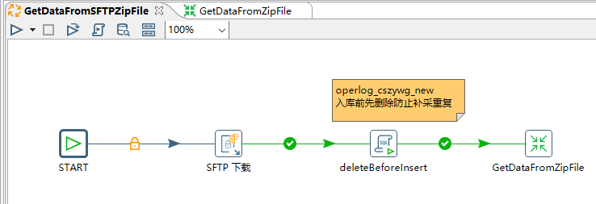
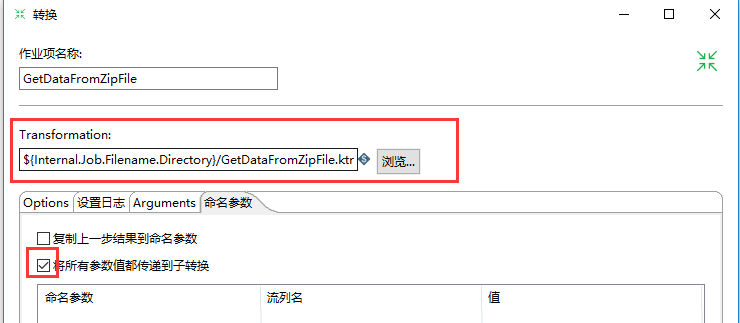
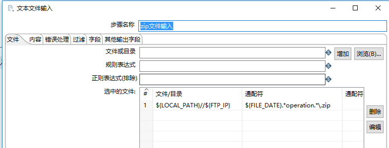
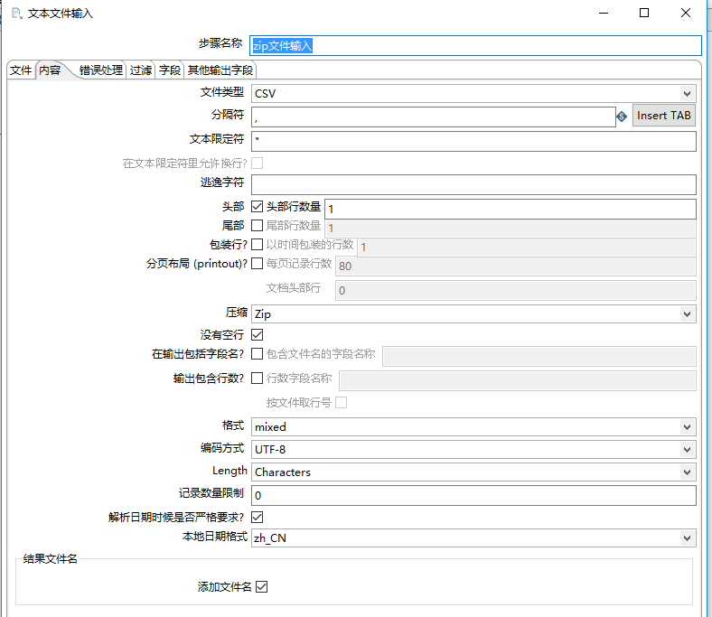
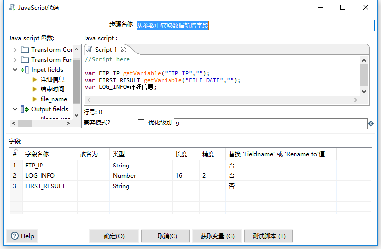

- [8. 完整的开发实例](#8-%E5%AE%8C%E6%95%B4%E7%9A%84%E5%BC%80%E5%8F%91%E5%AE%9E%E4%BE%8B)
  - [8.1. 一次基于命名参数和任务计划定时的Windows开发案例](#81-%E4%B8%80%E6%AC%A1%E5%9F%BA%E4%BA%8E%E5%91%BD%E5%90%8D%E5%8F%82%E6%95%B0%E5%92%8C%E4%BB%BB%E5%8A%A1%E8%AE%A1%E5%88%92%E5%AE%9A%E6%97%B6%E7%9A%84windows%E5%BC%80%E5%8F%91%E6%A1%88%E4%BE%8B)
    - [8.1.1. 前言](#811-%E5%89%8D%E8%A8%80)
      - [8.1.1.1. 环境](#8111-%E7%8E%AF%E5%A2%83)
      - [8.1.1.2. 业务说明](#8112-%E4%B8%9A%E5%8A%A1%E8%AF%B4%E6%98%8E)
    - [8.1.2. 设计](#812-%E8%AE%BE%E8%AE%A1)
      - [8.1.2.1. 流程组件设计](#8121-%E6%B5%81%E7%A8%8B%E7%BB%84%E4%BB%B6%E8%AE%BE%E8%AE%A1)
      - [8.1.2.2. 关键点设计](#8122-%E5%85%B3%E9%94%AE%E7%82%B9%E8%AE%BE%E8%AE%A1)
      - [8.1.2.3. 即将用到的组件](#8123-%E5%8D%B3%E5%B0%86%E7%94%A8%E5%88%B0%E7%9A%84%E7%BB%84%E4%BB%B6)
    - [8.1.3. 开发](#813-%E5%BC%80%E5%8F%91)
      - [8.1.3.1. 数据结构](#8131-%E6%95%B0%E6%8D%AE%E7%BB%93%E6%9E%84)
      - [8.1.3.2. 定义文件](#8132-%E5%AE%9A%E4%B9%89%E6%96%87%E4%BB%B6)
      - [8.1.3.3. 定义参数](#8133-%E5%AE%9A%E4%B9%89%E5%8F%82%E6%95%B0)
      - [8.1.3.4. 作业流程](#8134-%E4%BD%9C%E4%B8%9A%E6%B5%81%E7%A8%8B)
        - [8.1.3.4.1. 作业设置](#81341-%E4%BD%9C%E4%B8%9A%E8%AE%BE%E7%BD%AE)
        - [8.1.3.4.2. START](#81342-start)
        - [8.1.3.4.3. SFTP下载](#81343-sftp%E4%B8%8B%E8%BD%BD)
        - [8.1.3.4.4. deleteBeforeInsert](#81344-deletebeforeinsert)
        - [8.1.3.4.5. GetDataFromZipFile](#81345-getdatafromzipfile)
      - [8.1.3.5. 子转换](#8135-%E5%AD%90%E8%BD%AC%E6%8D%A2)
        - [8.1.3.5.1. 转换](#81351-%E8%BD%AC%E6%8D%A2)
        - [8.1.3.5.2. zip文件输入](#81352-zip%E6%96%87%E4%BB%B6%E8%BE%93%E5%85%A5)
        - [8.1.3.5.3. 从参数中获取数据新增字段](#81353-%E4%BB%8E%E5%8F%82%E6%95%B0%E4%B8%AD%E8%8E%B7%E5%8F%96%E6%95%B0%E6%8D%AE%E6%96%B0%E5%A2%9E%E5%AD%97%E6%AE%B5)
        - [8.1.3.5.4. 表输出到operlog_cszywg_new](#81354-%E8%A1%A8%E8%BE%93%E5%87%BA%E5%88%B0operlogcszywgnew)
    - [8.1.4. 调度运行](#814-%E8%B0%83%E5%BA%A6%E8%BF%90%E8%A1%8C)
      - [8.1.4.1. 测试脚本](#8141-%E6%B5%8B%E8%AF%95%E8%84%9A%E6%9C%AC)
      - [8.1.4.2. 任务计划](#8142-%E4%BB%BB%E5%8A%A1%E8%AE%A1%E5%88%92)
      - [8.1.4.3. 日志处理](#8143-%E6%97%A5%E5%BF%97%E5%A4%84%E7%90%86)
  - [8.2. 一次基于资源库的Linux开发案例](#82-%E4%B8%80%E6%AC%A1%E5%9F%BA%E4%BA%8E%E8%B5%84%E6%BA%90%E5%BA%93%E7%9A%84linux%E5%BC%80%E5%8F%91%E6%A1%88%E4%BE%8B)


## 8. 完整的开发实例
从部署到维护，分别给出Linux和Windows平台的两个例子，仅供参考。
### 8.1. 一次基于命名参数和任务计划定时的Windows开发案例
#### 8.1.1. 前言
##### 8.1.1.1. 环境
本机win10 64位 + Informix

##### 8.1.1.2. 业务说明
周期性每天从SFTP取日志文件解析入库。其中，SFTP服务器多个，采集的文件和最终解析都一致。
#### 8.1.2. 设计
##### 8.1.2.1. 流程组件设计
基本流程很简单，我们分两步：
1. 获取文件：SFTP组件 可以在作业中使用
2. 解析文件入库：转换使用文本文件输入和表输出组件可以使用

我们设计一个子转换，命名为 **GetDataFromZipFile** ，这个转换主要是读取下载的文件，解析入库；我们设计一个作业，命名为 **GetDataFromSFTPZipFile** ，下载文件，调用自转换解析入库。
##### 8.1.2.2. 关键点设计
有几个点需要注意：
1. 流程需要支持数据补采：针对下载的文件已存在就覆盖，针对入库的数据，入库前需要先删除
2. 下载的文件包含日期关键因素，如文件名 yyyyMMdd_xxxxxx.zip
3. 需要区别是从哪个SFTP服务器获取的数据，我们要把服务器IP也一并入库
4. 周期性的日期也需要设计在入库表中
5. 不同服务器的信息作为参数传递

##### 8.1.2.3. 即将用到的组件
* 作业
    - 通用 - START
    - 文件传输 - SFTP下载
    - 脚本 - SQL
    - 通用 - 转换
* 转换
    - 输入 - 文本文件输入
    - 脚本 - JavaScript代码
    - 输出 - 表输出

#### 8.1.3. 开发

##### 8.1.3.1. 数据结构
对日志信息这里简单定义为一个字段log_info
```sql
create table operlog_cszywg_new(
    first_result int, --周期时间 yyyyMMdd
    log_info lvarchar(1000), --日志信息
    ftp_ip varchar(20), --服务器IP
    file_name varchar(255), --文件名称
    insert_time datetime year to second default current year to second --默认插入时间为当前时间
);
```

##### 8.1.3.2. 定义文件
- 新建文件夹 `program` 作为主文件夹
- 新建 `log` 文件夹存储日志
- 新建 `file` 文件夹存储下载的文件
- 在`Spoon`页面新增转换保存为 `GetDataFromZipFile.ktr`
- 在`Spoon`页面新增作业保存为 `GetDataFromSFTPZipFile.kjb`

最终目录如下：


##### 8.1.3.3. 定义参数
定义以下参数：
|参数	|默认值	|描述|
|-|-|-|
|FILE_DATE|	20181127|数据日期，也是下载文件的关键信息|
|FTP_IP		||SFTP服务器的IP|
|FTP_PASS		||密码|
|FTP_PORT	|22	|端口号|
|FTP_USER		||登录账户|
|LOCAL_PATH	|E:\GetLogInfo\program\file|本地存储下载文件的路径	|
|REMOTE_PATH	||远程SFTP服务器上文件的路径|


##### 8.1.3.4. 作业流程
###### 8.1.3.4.1. 作业设置
作业相当于一条流水线，我们设计如图所示：



在画布上 **右键**-**作业设置** 打开作业属性，点击 **命名参数**，将参数预设。


###### 8.1.3.4.2. START
**START 开始**是入口。

###### 8.1.3.4.3. SFTP下载

`${ParamName}` 的方式访问参数。


远程服务器的文件存在对应文件夹下面对应的日期目录下，同时用正则去获取匹配的文件（同一个日期只有一个匹配的文件）。特别注意的是勾选 **创建目标文件** 。
- [x] 创建目标文件


###### 8.1.3.4.4. deleteBeforeInsert
要注意勾选 **使用变量替换**。
- [x] 使用变量替换


###### 8.1.3.4.5. GetDataFromZipFile
转换的目录写相对目录：`${Internal.Job.Filename.Directory}/GetDataFromZipFile.ktr`,即 作业所在目录下该转换；勾选 **将所有参数值都传递到子转换。**
- [x] 将所有参数值都传递到子转换。




##### 8.1.3.5. 子转换
###### 8.1.3.5.1. 转换
我们这个作业相当于一个超级兵，他能获取下载的文件，并对数据处理入库。


###### 8.1.3.5.2. zip文件输入
* 文件

注意 **文件/目录** 填写的是本地下载的文件目录。



* 内容
    - 文件类型：`CSV`表示分隔符文件，`Fixed`表示固定长度字段文件
    - 分隔符：按实际情况填写
    - 头部数据：表头
    - 是否压缩文件：本例zip压缩
    - 格式：根据实际情况选择（DOS,Unix,mixed)
    - 编码方式：根据实际情况选择



* 错误处理：可以过滤不要的数据。


* 字段：根据分隔符分隔的字段，可以对字段类型进行初步处理


* 其他输出字段：本文需要的文件名称


###### 8.1.3.5.3. 从参数中获取数据新增字段
FTP_IP和日期均为父作业传过来的，我们用 JavaScript代码组件获取这两个数据，并给每一行数据新增两个相应字段。顺便，我们把 上一步输入的 **详细信息** 赋值给 `LOG_INFO` 和数据库字段对应。



###### 8.1.3.5.4. 表输出到operlog_cszywg_new
由于上一步输入的数据各字段和表字段一致，我们不需要指定数据库字段。批量提交可以更快更稳定的输出数据。
- [ ] 指定数据库字段
- [X] 使用批量插入


#### 8.1.4. 调度运行
##### 8.1.4.1. 测试脚本
##### 8.1.4.2. 任务计划
##### 8.1.4.3. 日志处理

### 8.2. 一次基于资源库的Linux开发案例
